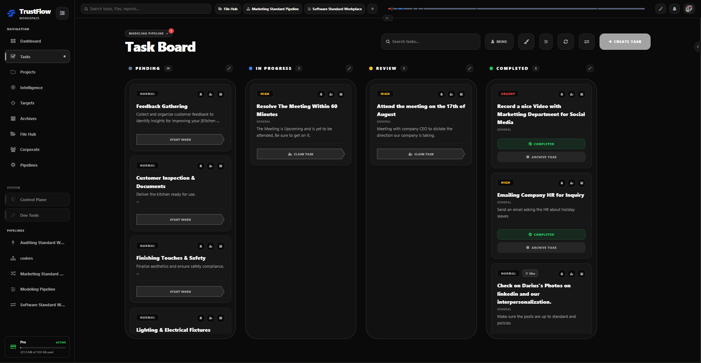
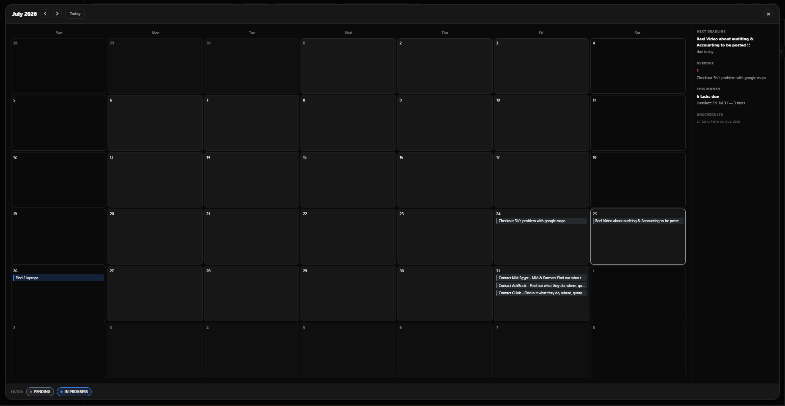
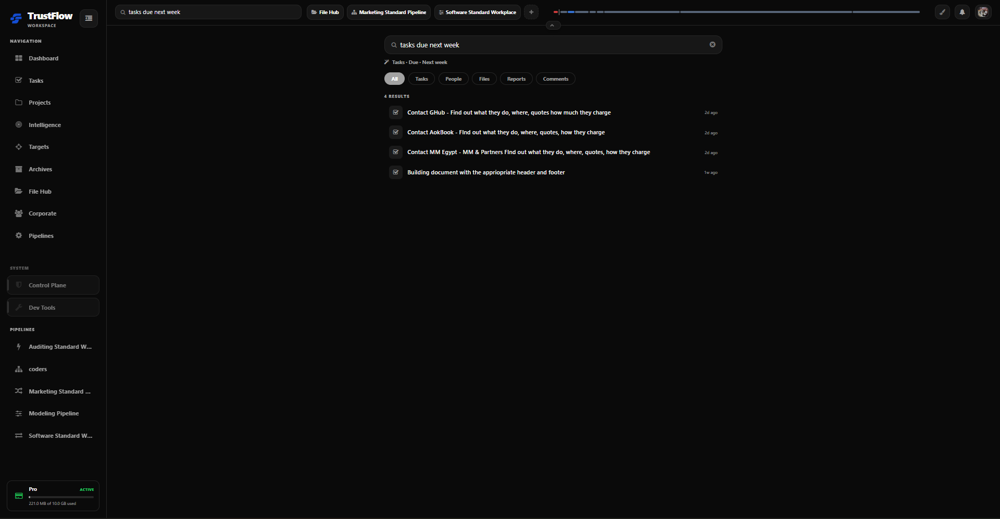

<div align="center">


# TrustFlow

**Run your team's work from one calm screen.**

Tasks, pipelines, files, and reporting — together, on desktop and in your pocket — so nothing slips through and no one has to ask twice.

[](https://expo.dev)
[](https://reactnative.dev)
[](https://supabase.com)
[](https://www.typescriptlang.org/)

</div>

---

## What is TrustFlow?

TrustFlow is a configurable **pipeline workflow engine** wrapped in a task management platform. Instead of a generic to-do list, work moves through pipeline **stages** you design — each with its own required approvals, submissions, timers, and automations. Managers get a live picture of where every task actually stands; teams get a clear, single place to do the work.

It's one codebase, everywhere: a single React Native + Expo app ships to **web, iOS, and Android**, backed by Supabase/Postgres with row-level security enforced end-to-end.

## Features

- **Pipelines & stages** — Model your real process: stages, transitions, required permissions, and terminal outcomes (success/revision/failure), all configurable per workflow.
- **Task boards** — Pending, in progress, review, and completed, always up to date. Priority, timers, and ownership live right on the card.
- **Calendar** — Deadlines, overdue items, and unscheduled work in one monthly view, with a live "next deadline" summary.
- **Smart search** — One search bar across tasks, files, people, reports, and comments, with natural-language date filters like "due next week."
- **File Hub** — Direct messages, broadcasts, and versioned shared files, so the right document is never buried three inboxes deep.
- **Reports & Intelligence** — Throughput, completion rate, and SLA risk (stall/deadline/over-budget signals), so you know whether work is *actually* moving.
- **Timers & submissions** — Track effort per stage and require evidence before work advances.
- **Automations** — Trigger stage actions automatically instead of chasing status updates.
- **Roles & permissions** — Company-scoped data isolation via Postgres RLS, down to individual pipeline actions.
- **Realtime** — Supabase Realtime channels keep boards, badges, and notifications live across every device.

## Screenshots

<table>
<tr>
<td width="34%"></td>
<td width="33%"></td>
<td width="33%"></td>
</tr>
<tr>
<td align="center"><sub>Task Board — pipeline-driven stages</sub></td>
<td align="center"><sub>Calendar — deadlines at a glance</sub></td>
<td align="center"><sub>Smart Search — everything, one bar</sub></td>
</tr>
</table>

## Tech stack

| Layer | Technology |
|---|---|
| App | React Native, Expo Router, NativeWind (Tailwind), TypeScript |
| Backend | Supabase (Postgres) — all mutations via `SECURITY DEFINER` RPCs, RLS on every table |
| Auth | Supabase Auth |
| Realtime | Supabase Realtime channels |
| Marketing site | Astro + Tailwind (`website/`), deployed separately from the app |

## Project structure

```
app/(tabs)/              Expo Router tab screens
components/               UI components (task-detail/, pipeline-editor/, ...)
contexts/                 React contexts (TaskDetailContext, PipelineEditorContext, TimerContext, ...)
lib/supabase.ts           Supabase client
supabase/migrations/      Database schema, RPCs, and RLS policies
website/                  Public marketing site (Astro, separate deploy)
docs/                     Internal engineering notes
```

## Getting started

**Prerequisites:** Node.js, npm, and a Supabase project.

```bash
# Install dependencies
npm install

# Configure environment
cp .env.example .env
# then fill in EXPO_PUBLIC_SUPABASE_URL, EXPO_PUBLIC_SUPABASE_ANON_KEY, etc.

# Start the app
npm start        # Expo dev server — press w for web, or scan the QR code
npm run web       # web only
npm run ios       # iOS simulator
npm run android   # Android emulator
```

Seed sample data for local development:

```bash
npm run seed        # a single seeded company (Acme Corp)
npm run seed:full   # a fuller, multi-pipeline dataset
```

Run tests:

```bash
npm test
```

Want a fully local backend (Postgres/Auth/Storage in Docker) instead of pointing at a
shared Supabase project? See [docs/LOCAL_SUPABASE_DEV.md](docs/LOCAL_SUPABASE_DEV.md).

## License

Proprietary — © TrustEdge LLC. All rights reserved.
